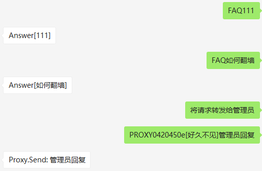

# For
- 拥有微信号「A」与「B」，分别用于对接客户和客服人员
- 尝试在用户「C」给「A」发消息时，**自动回复** | 将「C」发的消息 **转发** 给「B」| 将「B」处理的结果 **反馈** 给「C」

# Finish
## List
- 登录
- 获取成员列表，指定「B」角色 ID
- 自动收消息
    - 根据内容自动处理
        - 将「C」的特定消息转发给「B」
        - 将「B」回复「C」的消息，发送给「C」
        - 针对特定消息进行处理

## TODO
- 尝试群组相关
- 尝试文件、图片等格式数据发送
- 自动回复数量监控
- 管理员账号的 PUID 指定
- Reference.3 文章中形式的探讨

## Result
- 

# Prepare
## download
- `pip install -U wxpy -i "https://pypi.doubanio.com/simple/"`

# Reference
- [youfou/wxpy](https://github.com/youfou/wxpy)
- [wxpy](http://wxpy.readthedocs.io/zh/latest/bot.html)
- [Python玩微信（2）:wxpy的进阶](https://www.jianshu.com/p/ef75e97146c2)